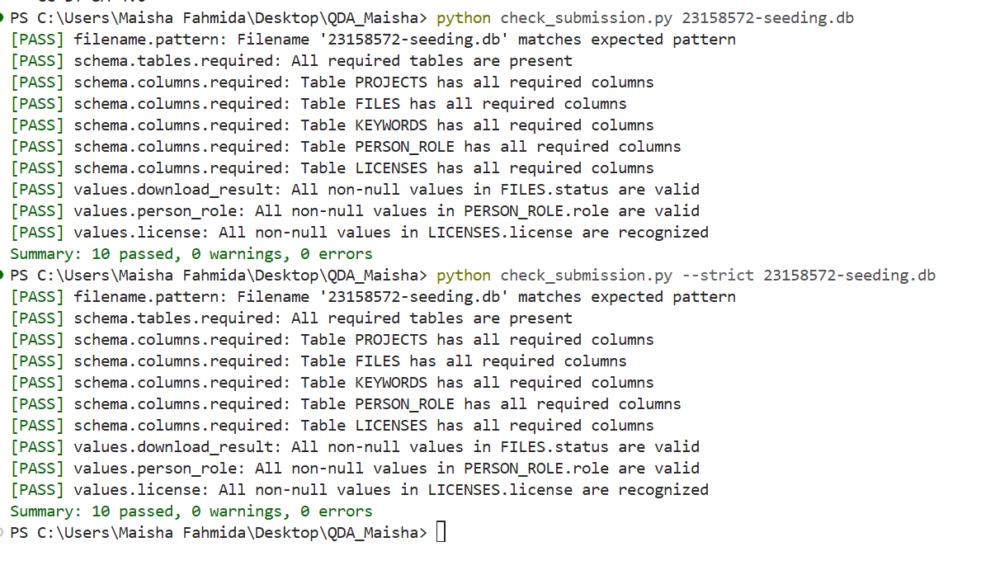

Here is your **final README.md** exactly ready for GitHub.
Just **copy → paste → commit**. Nothing else needed.

---

```markdown
# Author

- **Name:** Maisha Fahmida
- **Student ID:** 23158572
- **University:** Friedrich-Alexander-Universität Erlangen-Nürnberg (FAU)
- **Supervisor:** Prof. Dr. Dirk Riehle

---

# Full Project Overview

This project contributes to the **QDArchive (Qualitative Data Archive)** initiative by building an automated pipeline to discover, download, and structure qualitative research datasets, and then classify them for future analysis.

The work is divided into two main parts:

**Part 1 — Data Acquisition** searches open data repositories for qualitative and QDA-related research projects, downloads publicly accessible files where available, extracts metadata (titles, descriptions, keywords, authors, licenses), and stores everything in a normalized SQLite database (`23158572-seeding.db`).

**Part 2 — Classification** extends the acquired database by classifying every project into one of four project types (`QDA_PROJECT`, `QD_PROJECT`, `OTHER_PROJECT`, `NOT_A_PROJECT`) based on the file types it contains. Relevant `QD_PROJECT` records are then classified against the **ISIC Rev. 5** taxonomy at the Section + Division level, using a weighted keyword-matching classifier that combines project metadata (title, description, keywords) with text extracted directly from each project's primary data files. Each primary data file is also classified individually where extractable text is available.

The final workflow produces a complete set of outputs: the classification SQLite database, an XLSX results table, repository-level statistics, vector-based classification histograms, ranked top-class tables, and a final PDF report.

Overall, the project demonstrates an end-to-end pipeline covering **automated data acquisition, database construction, project-type classification, ISIC Rev. 5 categorization, primary-file classification, validation, and final result reporting.**


##  Part 1 — Data Acquisition

This project contributes to the **QDArchive (Qualitative Data Archive)** by building an automated pipeline that:

* discovers datasets from research repositories
* downloads available dataset files
* extracts metadata
* stores structured information in a SQLite database

The system is designed for datasets compatible with **Qualitative Data Analysis (QDA)** tools such as:

* NVivo
* ATLAS.ti
* MAXQDA
* REFI-QDA (.qdpx)

---

##  Project Objectives

* Automate dataset collection from repositories
* Download dataset files when publicly accessible
* Extract structured metadata
* Store license information correctly
* Build a normalized SQLite database
* Prepare data for further validation and analysis

---

##  Data Sources

| Repository             | ID | Method                                         |
| ---------------------- | -- | ---------------------------------------------- |
| AUSSDA (Dataverse)     | 1  | API + direct file download                     |
| UK Data Service (UKDS) | 2  | DataCite API + GraphQL + signed download links |

---

##  System Workflow

```

main.py
↓
AUSSDA pipeline        UKDS pipeline
↓                      ↓
File + Metadata        Metadata + File download
↓                      ↓
SQLite Database (5 tables)

````

---

##  Database Schema

The system uses a normalized SQLite schema:

| Table       | Purpose                  |
| ----------- | ------------------------ |
| projects    | Dataset-level metadata   |
| files       | Downloaded file tracking |
| keywords    | Dataset keywords         |
| person_role | Authors and contributors |
| licenses    | License information      |

---

##  Repository Processing Pipelines

###  AUSSDA Pipeline

* Uses Dataverse API
* Retrieves metadata and files
* Downloads dataset files directly
* Extracts:

  * title
  * description
  * authors
  * keywords
  * license

---

### UK Data Service (UKDS) Pipeline

* Uses **DataCite API** to discover datasets
* Uses **GraphQL API** to fetch detailed metadata
* Downloads files using **signed S3 URLs**
* Extracts:

  * DOI
  * title
  * description
  * authors
  * keywords
  * license

---

## License Extraction Strategy

License information is handled in multiple steps:

1. Extracted from GraphQL field (`AccessCondition`)
2. Parsed using **BeautifulSoup** (HTML → text)
3. If missing → fallback mapping using DOI

### Examples

* Creative Commons Attribution 4.0
* Creative Commons BY-SA 4.0
* Open Government Licence

This ensures license is always stored in the database.

---

##  File Handling Status

| Status        | Description                   |
| ------------- | ----------------------------- |
| SUCCEEDED     | File downloaded and extracted |
| FAILED_SERVER | Download failed               |

---

##  Execution Guide

###  Install Dependencies

```bash
pip install requests beautifulsoup4
````

---

### Run the Pipeline

```bash
python -m repositories.process_ukds_batch
```

or

```bash
python main.py
```

---

## Output Artifacts

### Database

```
23158572_id-seeding.db
```

### Downloaded Files

```
data/downloads/aussda/
data/downloads/ukds/
```

---

## Project Structure

```
QDA_Maisha/
│
├── main.py
├── 23158572_id-seeding.db
│
├── repositories/
│   ├── __init__.py
│   ├── aussda_repository.py
│   ├── ukds_repository.py
│   └── process_ukds_batch.py
│
├── downloader/
│   ├── __init__.py
│   └── downloader.py
│
├── data/
│   ├── ukds_download_list.json
│   └── downloads/
│       ├── aussda/
│       └── ukds/
│
├── database/
│   └── database.py
│
└── tests/
    └── validator.py
```

---

## Limitations

### UKDS Constraints

* Some datasets require authentication
* Signed URLs expire quickly
* Some datasets are not publicly downloadable

---

### Metadata Issues

* Some datasets have missing or unclear license
* License fallback is used when needed

---

### Duplicate Data

* Duplicate entries may occur
* No deduplication implemented yet

---

## Validation Status

* SQLite database structure implemented
* License handling implemented
* Validator integration prepared

Validation script not fully executed yet

### 📸 Validation Proof



---

## Future Improvements

* Run full SQLite validation
* Implement duplicate detection (based on DOI)
* Improve license normalization
* Add more repositories
* Enhance QDA file detection

---

## Project Outcome

This project successfully:

* collects real-world datasets
* downloads files from AUSSDA and UKDS
* extracts structured metadata
* stores data in a normalized database

It meets the requirements of:

* data collection
* metadata extraction
* database design
* pipeline automation

---

## References

* QDArchive Project
* REFI-QDA Standard
* AUSSDA Dataverse
* UK Data Service
* DataCite API

---

